# 2025年排名前18的车队燃油卡汇总(最新整理)

管理一支车队,燃油开支往往是最让人头疼的部分。司机在哪儿加油?加了多少?有没有人偷偷刷卡买零食?这些问题每天都在发生。好消息是,现在有专门针对企业车队设计的燃油卡,能帮你把这些乱七八糟的事儿理清楚。这篇文章整理了2025年市场上值得关注的车队燃油卡平台,涵盖了不同规模企业的需求——从小型配送车队到全国范围的长途运输公司,总有一款适合你的场景。

---

## **[Coast](https://coastpay.com)**

专为中小型车队打造的现代化燃油管理方案

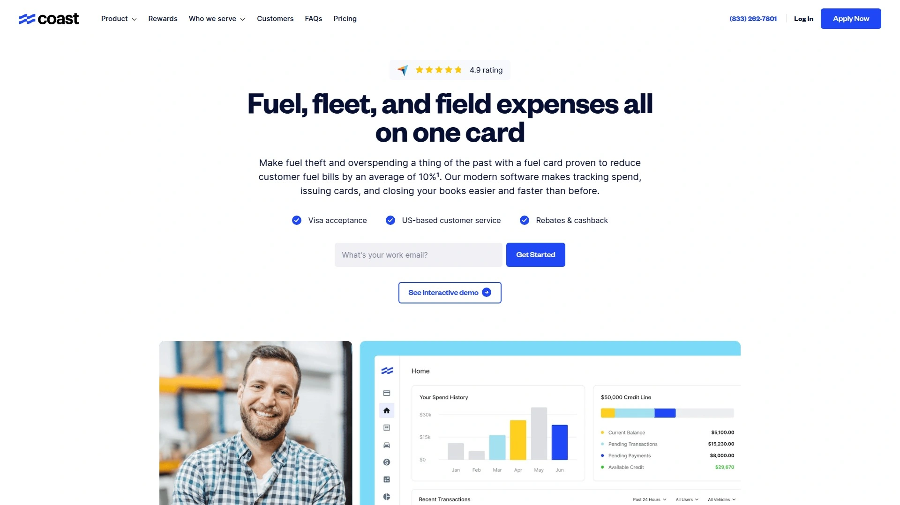

Coast把传统燃油卡该有的功能都做到了,但更重要的是,它把那些让人抓狂的细节也处理得很好。这张卡基于Visa网络,意味着你的司机可以在任何接受Visa的地方加油,不用专门绕路去找指定加油站。在全美30,000多个加油站,每加仑能省3-9美分,而且这个折扣不分等级,每一加仑都算数。

**防作弊这件事,Coast是认真的。** 他们提供独特的司机验证功能,结合GPS自动拒付机制,确保每笔交易都能对应到具体的司机和车辆。如果有人试图在不该出现的地方刷卡,系统会直接拦下来。这套安全机制他们很有信心,甚至提供每年最高25,000美元的欺诈保护担保。

使用体验上,Coast的管理后台设计得挺直观。你可以给每张卡设置精确的消费规则——比如只能买燃油,或者限制单次加油金额。所有交易实时显示,月底对账的时候也不用再去翻一堆纸质小票。客户服务团队在美国本地,遇到问题打电话不用等太久。月费每张卡4美元,对于能省下的油钱和管理时间来说,这个成本还算合理。

***

## **[WEX](https://www.wexinc.com)**

覆盖面广、老牌稳定的车队燃油卡服务商

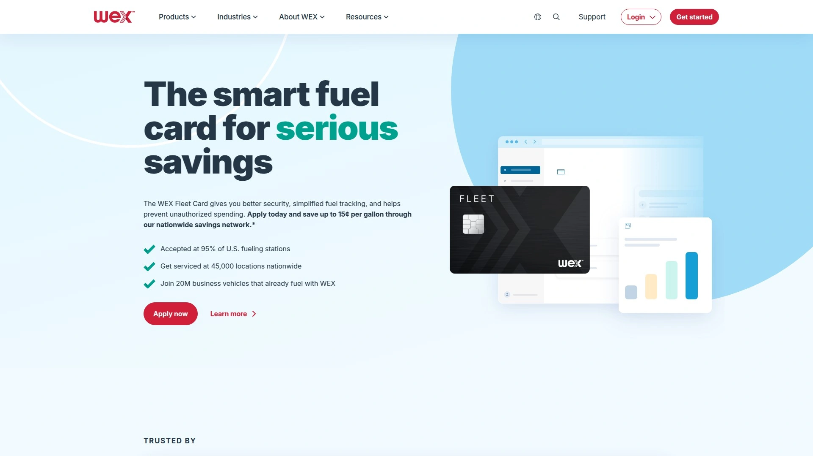

WEX在燃油卡行业做了很多年,网络覆盖到全美95%的加油站,大约180,000个地点都能用。他们的卡在特定网络内可以省每加仑最多15美分,其他地方也能省3美分左右。这个"特定网络"具体包括哪些站点,需要根据你的账户类型来定,但整体来说可选择性很高。

WEX的强项在于控制和数据。管理员可以设置司机PIN码,限制交易时间、金额,还能按商品类别限制消费。比如你不想让员工用公司卡买便利店的东西,直接在系统里关掉这个类别就行。报告功能很详细,可以导出各种维度的数据用于分析。

**适合规模:** 从小企业到大型车队都可以用,但大车队能拿到更好的折扣条件。月费根据账户类型,每张卡最多2美元。如果你的车队已经有一定规模,需要深度的费用分析和控制能力,WEX是个靠谱的选择。

***

## **[Voyager Fleet Card](https://www.usbank.com)**

双网络支持,北美通用

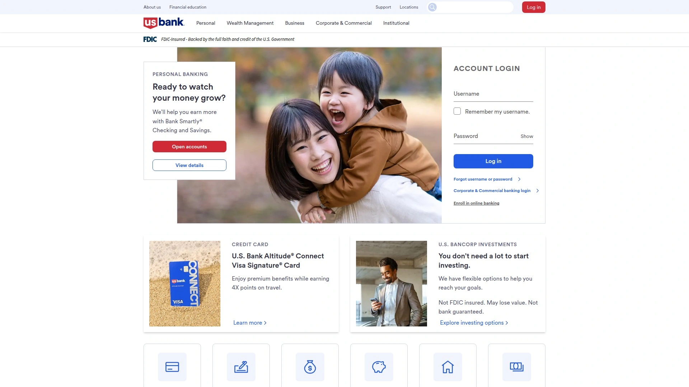

美国银行推出的Voyager卡运行在Voyager和Mastercard双网络上,这意味着除了在美国境内广泛使用,去加拿大和墨西哥也能刷。对于跨境运输的车队来说,这点特别实用。

- 单一管理平台处理所有卡片和司机信息
- 支持加油、维修、应急开支等多种场景
- 可以追踪预购燃油和移动加油服务
- 详细的交易数据捕捉,包括加油等级、加仑数等

Voyager允许你给每张卡或每个司机设置不同的规则,泵边提示功能会要求输入里程表读数,这样既能防止滥用,又能顺便收集车辆使用数据。折扣力度取决于你跟哪些加油站有协议,以及参与的商户网络。

***

## **[Fuelman](https://www.fuelman.com)**

60,000个加油站和卡车服务站可用

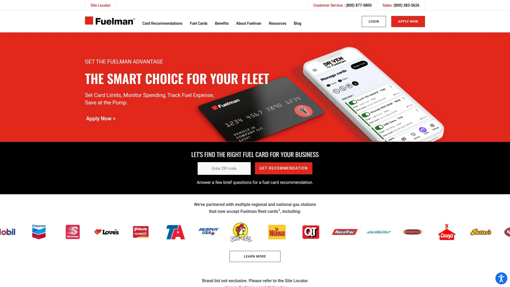

Fuelman在全美有60,000个接受地点,覆盖了大部分主流品牌。他们提供多个账户层级,从基础版到企业版,功能和费用都不一样。混合车队卡每加仑最多省8美分,柴油车队卡最多能省12美分。

账户费用是按月收取的,根据你选的套餐,从39.99美元到99.99美元不等。企业版和专业版用户可以获得最高25,000美元的欺诈保护。Fuelman的客户门户网站提供常规的消费控制、报告下载等功能。

**需要注意:** Fuelman在Trustpilot上的评分只有2.2星,用户反馈的问题主要集中在客服响应速度和账单透明度上。如果你考虑这家,建议先仔细了解合同条款。

***

## **[AtoB](https://www.atob.com)**

金融科技公司推出的Mastercard车队卡

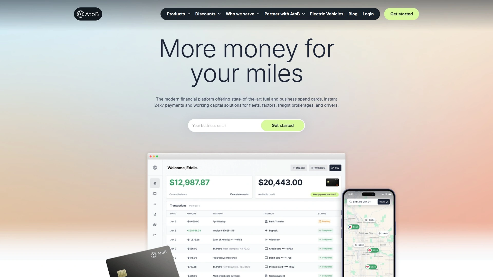

AtoB是一家相对较新的公司,用金融科技的思路来做燃油卡。他们的卡基于Mastercard网络,全国通用。在卡车服务站能省大约每加仑45美分,普通加油站能省5美分左右。手机App可以帮司机找到沿途最便宜的加油站。

**定价结构:** 1-5张卡月费15美元,之后每增加一张卡加3美元。如果想要高级版功能,每张卡再加3美元。还有35美元的设置费。

AtoB的管理界面比较现代化,支持跟多种车队管理软件集成。他们的客户评分在Trustpilot上是4.6星,用户普遍觉得界面好用,折扣力度也还可以。适合需要灵活性和技术集成的中小型车队。

***

## **[Comdata](https://www.comdata.com)**

面向长途卡车运输公司的专业方案

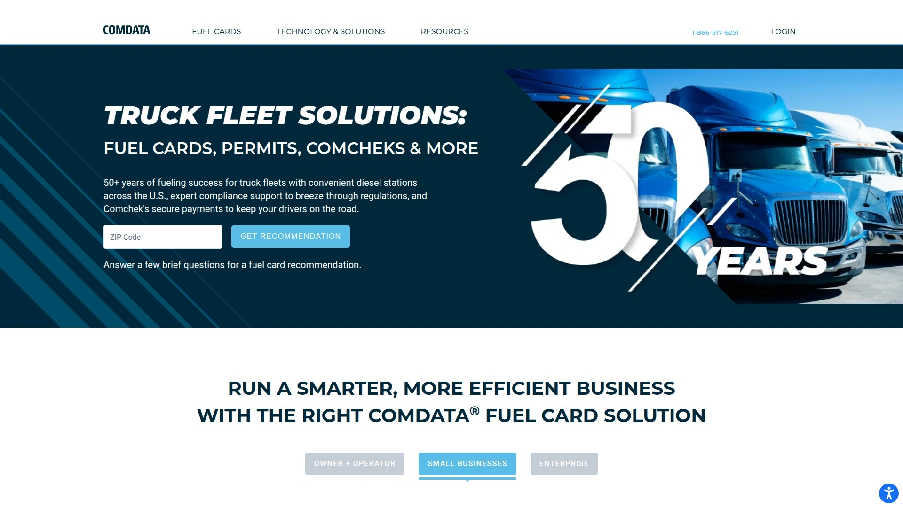

Comdata主要服务于长途卡车运输(OTR)车队,在全美8,000个卡车服务站接受使用。在指定服务站,每加仑能省7-25美分——这个折扣范围很大,具体看加油站和你的账户情况。

除了加油,Comdata还提供车队管理的其他服务,比如路桥费、许可证办理、税务处理等。对于大型运输公司来说,这种一站式服务能简化不少行政工作。月费每张卡最多8美元。

Comdata的系统相对复杂一些,上手需要时间,但一旦配置好,功能确实强大。适合已经有专人负责车队管理的中大型运输企业。

***

## **[CFN](https://www.cfnnet.com)**

美国西部地区的卡锁式加油网络

CFN在美国西部有3,000个折扣卡锁加油站,另外在全国范围内还能用65,000个零售加油站和卡车服务站。卡锁站点的优势是价格通常比零售站低很多,估计每加仑能省35美分左右。

**特别适合:** 在加州、俄勒冈、华盛顿、内华达等西部州运营的混合车队。CFN的站点对18轮大卡车友好,很多位置专门设计了大车通道。

CFN采用成本加成定价模式,对客户比较透明。客户门户网站每天更新价格,方便你提前规划路线和加油点。没有月费,有免费的防欺诈保护。Trustpilot评分4.8星,用户反馈主要夸奖价格实惠和站点方便。

***

## **[Fleet One Edge](https://www.fleetone.com)**

小型OTR车队的入门选择

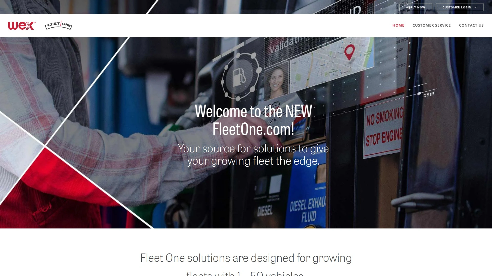

Fleet One Edge专注服务小型长途运输公司,网络覆盖12,000个卡车服务站。在指定站点平均每加仑省15美分。月费结构是每张卡8美元,账户本身还有7.95美元的费用。

这个项目比较适合刚开始做长途运输、车队规模不大的公司。站点数量虽然比不上WEX那种巨头,但对于跑固定路线的小车队来说够用了。

***

## **[TCS Fuel Card](https://www.tcsfuelcard.com)**

依托Comdata和EFS网络的OTR卡

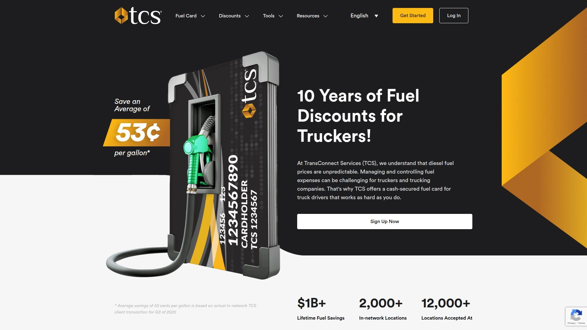

TCS借用Comdata和EFS的加油网络,在12,000个卡车服务站可以使用,其中大约2,000个是"网络内"站点,提供更大折扣。网络内站点平均每加仑省48美分,这个数字在行业里算是很有竞争力的。

TCS还提供货运保理服务,对于现金流紧张的小运输公司来说,这个附加服务挺实用。在TA卡车服务中心购买轮胎和保养服务也有折扣。手机App可以帮你定位站点和查看价格。

网络外交易会收取手续费,所以如果你的路线主要覆盖TCS网络内站点,这张卡很划算;如果经常跑偏远地区,可能就不太合适了。

***

## **[Ramp](https://ramp.com/fleets)**

企业费用管理平台推出的车队卡

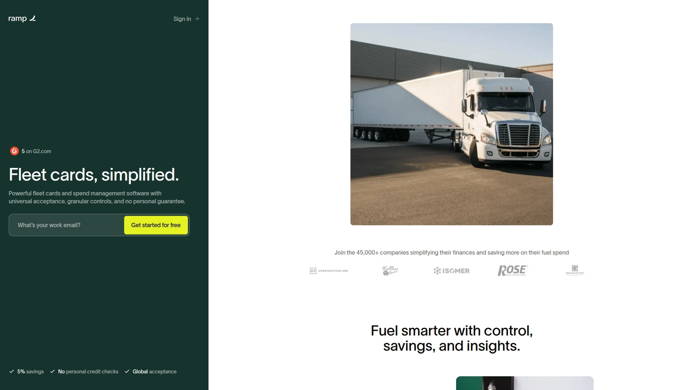

Ramp本质上是一家企业费用管理公司,他们的车队卡是公司卡功能的延伸。基于Visa网络,在任何接受Visa的地方都能用,不会因为"网络外"而被额外收费。

**核心优势:** 每笔消费都有现金返还,包括加油。平均每加仑能省5美分,同时还能拿到返现积分。费用追踪和报告功能很强,可以按司机、车辆类型、日期等各种维度查看开支。

Ramp允许你设置只能买燃油的卡片,或者限制某些商户类别。实时政策提醒、自动收据匹配这些功能都有。适合已经在用Ramp管理其他企业开支的公司,把车队费用也整合进来,统一管理。

没有年费,不需要个人担保。但要求公司在美国银行账户里至少有25,000美元。

***

## **[EFS Fleet Card](https://www.efsllc.com)**

电子资金源系统的长途运输方案

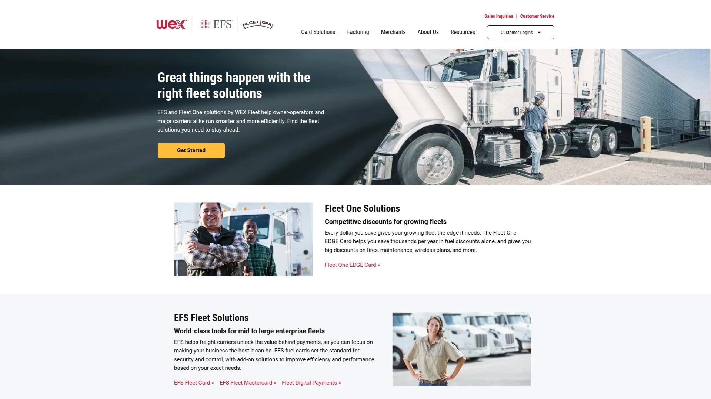

EFS卡在广泛的加油站网络都能使用,提供消费限制控制、折扣燃油采购、返利和奖励等功能。除了加油,还能用于车辆维修保养、道路救援等场景。

EFS的在线工具相对完善,可以实时查看交易、下载报告、管理卡片状态。对于需要全面费用管理的车队来说,EFS提供的功能覆盖范围比较广。

***

## **[Shell Fleet Solutions](https://www.shell.us/business/mobility/shell-fleet-solutions.html)**

品牌加油站推出的车队计划

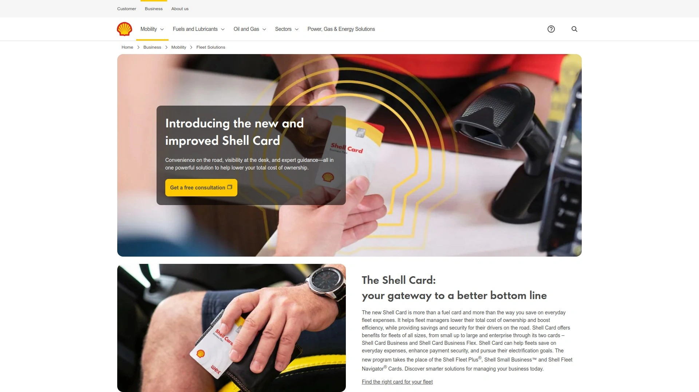

Shell的车队卡可以在Shell旗下品牌加油站获得分级返利,返利金额跟每月加油量挂钩。在Jiffy Lube做车辆保养有折扣,部分Shell站点还有额外的奖励返利。

Shell卡的一个特色是支持混合车队管理——同一张卡既能加油,也能支付电动车充电费用。对于正在向电动化转型的车队来说,这种灵活性很有价值。Shell还为大型车队提供电动化转型的咨询服务。

司机可以参加Fuel Rewards®忠诚计划,用公司卡加油的同时,个人账户也能累积积分,用于个人车辆的折扣。

***

## **[ExxonMobil FleetPro](https://www.exxonmobilfleetcards.com)**

适合柴油车队的单卡解决方案

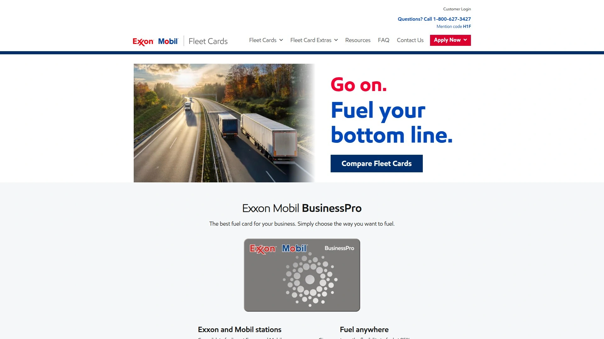

ExxonMobil有两个车队产品:FleetPro和BusinessPro。FleetPro专注于柴油和混合燃料车队,可以在12,000多个Exxon和Mobil站点使用,其中包括700多个商业卡车站。基于Mastercard网络,必要时也能在其他地方刷卡应急。

定价是定制化的,根据你的加油量提供柴油折扣。司机用公司卡加油时,个人可以通过Exxon Mobil Rewards+计划赚取积分。

BusinessPro版本则侧重于普通商用车队,在Exxon和Mobil站点每加仑最多省6美分,通过WEX网络扩展到全美95%的加油站。没有设置费、年费或月卡费。

***

## **[BP earnify fleet](https://www.bp.com/en_us/united-states/home/products-and-services/earnifyfleet.html)**

2025年BP与WEX新推出的车队卡计划

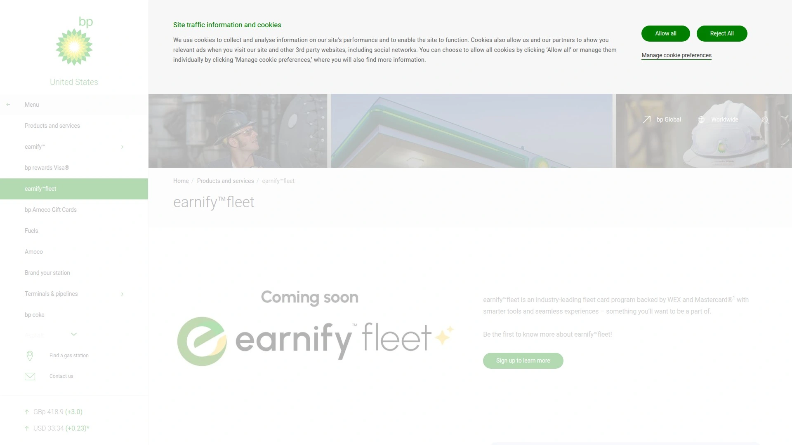

BP在2025年7月终止了跟Fleetcor的长期合作,转而跟WEX联手推出earnify fleet卡。这张卡覆盖BP的8,000多个加油站网络,包括BP、Amoco、TravelCenters of America和Petro,2026年计划加入Thorntons。

earnify fleet不只是燃油卡,还能支付零件、维修、过路费、洗车、停车和道路救援等费用。如果你想限制消费类别,可以设置采购控制。卡片采用芯片技术,增强防欺诈保护。

司机可以注册earnify奖励计划,用车队卡加油时在个人账户赚取积分。这个项目刚推出不久,具体的折扣力度和费用结构还在完善中。

***

## **[Chevron & Texaco Business Cards](https://www.chevrontexacobusinesscard.com)**

西部地区常见的品牌加油站卡

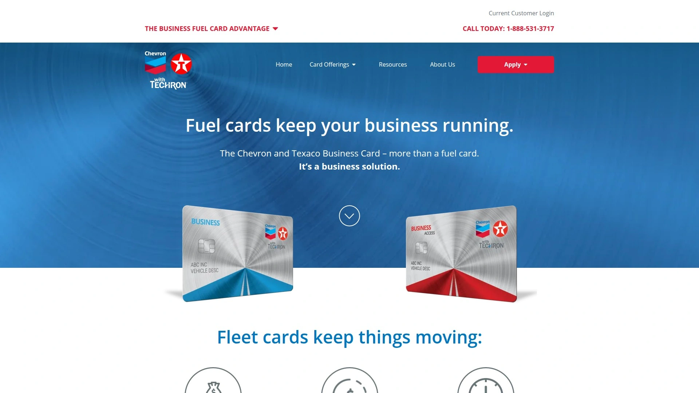

Chevron和Texaco在全美有8,000多个站点,用他们的车队卡在品牌站点每加仑最多省6美分。有两个版本:Business Card只能在Chevron和Texaco用;Business Access Card通过WEX网络扩展到全美95%的加油站。

两个版本都没有设置费、月费或年费。提供标准的消费控制功能:司机PIN码、里程表读数、按金额/时间/地点限制等。在线和手机端管理工具免费提供,可以查看交易、支付账单、管理卡片。

Chevron和Texaco Business Card用户还能享受汽车配件、轮胎、酒店等其他商业支出的专属折扣。

***

## **[Sunoco Fleet Cards](https://www.sunoco.com)**

东北部和中大西洋地区的实惠选择

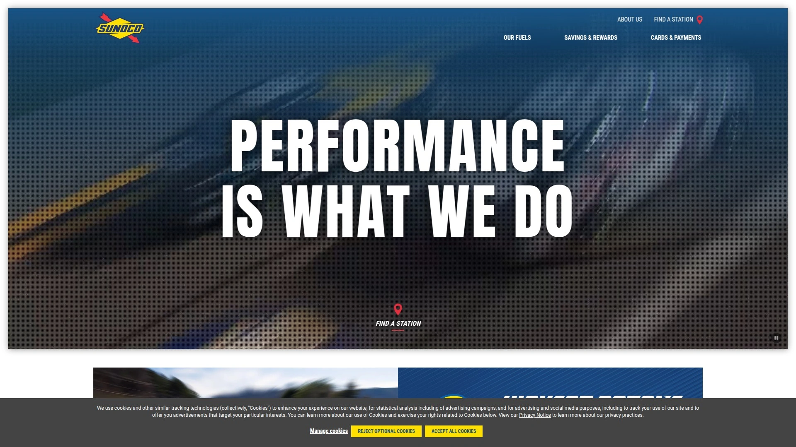

Sunoco有两款车队卡:Business Fleet Card只在5,000多个Sunoco站点使用;Universal Fleet Card扩展到全美95%的加油站和45,000个服务地点。

目前有限时优惠:新账户前6个月每加仑省15美分,之后降到每加仑最多6美分。没有设置费或卡片费。Universal版本有较低的月卡费。

Sunoco的客户门户和Fleet SmartHub移动App功能齐全,可以查看交易、支付账单、添加/删除卡片、设置消费控制、下载各种报告。对于在东海岸运营的车队来说,Sunoco的站点密度很高,找站方便。

***

## **[Speedway (7-Eleven) Business Fleet Card](https://www.speedwayfleetcards.com)**

便利店巨头推出的车队方案

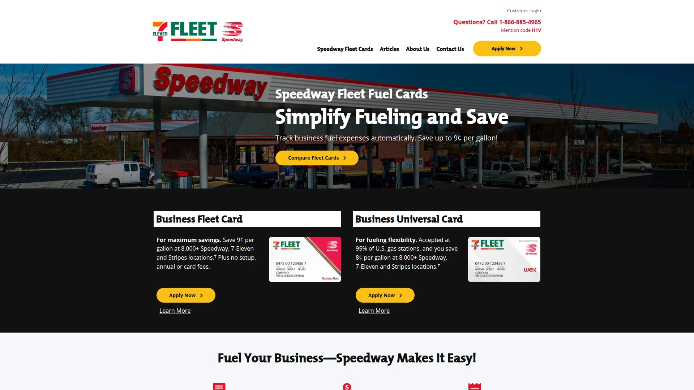

Speedway现在归7-Eleven所有,他们的车队卡可以在Speedway、7-Eleven和Stripes品牌的8,000多个加油站使用,每加仑汽油和柴油最多省9美分。没有设置费、年费或月卡费。

通过WEX提供后台支持,所以消费控制、报告、移动App这些功能都是WEX那套系统。司机PIN码、里程表读数、按类别/时间/金额限制都能设置。

Speedway的站点通常也是便利店,如果你需要让司机买一些路上的物资,可以开放相应的消费类别;如果只想让他们加油,也可以严格限制。

***

## **[Phillips 66/Conoco/76 Fleet Cards](https://www.phillips66fleet.com)**

三大品牌联合的西部和中部车队卡

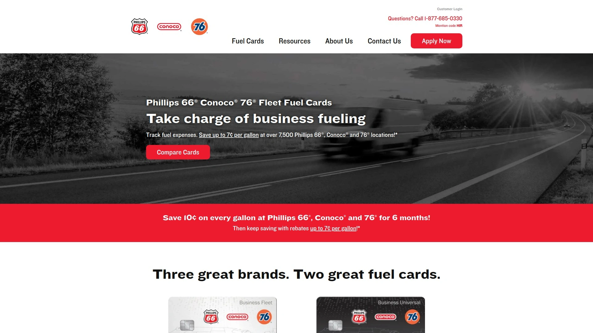

Phillips 66、Conoco和76是一家公司旗下的品牌,车队卡通用。在全美7,500多个品牌站点每加仑最多省7美分。有限时推广:新客户前6个月每加仑省10美分。

同样分两个版本:Business Fleet Card只在品牌站点用;Business Universal Card扩展到全美95%的加油站。两个版本都没有年费或卡片费。

管理功能包括司机PIN码、里程表读数、自动燃油记账、税务豁免报告(符合条件的企业)、定制报告等。免费的移动App可以查找司机ID、查看交易、支付账单、取消丢失卡片等。

用户还能享受汽车配件、轮胎、酒店等其他开支的独家折扣。

***

## **[Enterprise Fleet Management Fuel Program](https://www.efleets.com)**

租赁巨头提供的燃油管理服务

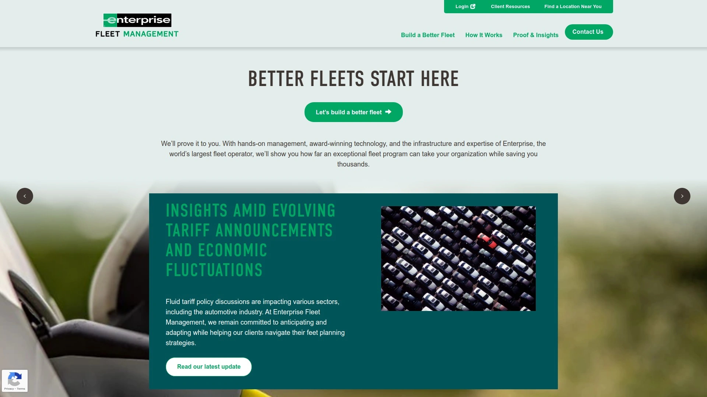

Enterprise Fleet Management通过WEX网络提供燃油卡服务,接受度覆盖全美90%以上的零售加油站。他们的客户报告说,整体燃油管理成本降低了最多15%。

Enterprise的优势在于整合:如果你本身就在租赁Enterprise的车辆,那么燃油卡、车辆维护、保险等服务可以在一个系统里管理,简化了很多流程。

燃油卡捕捉三级详细数据,包括司机信息、加油站、油品等级、加仑数、单价等。可以设置采购规则,限制司机能买什么、在哪儿买、什么时候买。有风险欺诈警报,发现可疑交易立即通知。

跟部分燃油供应商有预谈判的返利协议,能拿到优惠价格。适合已经在用Enterprise车辆租赁服务的企业,把燃油管理也整合进来。

***

## 常见问题

**车队燃油卡跟普通公司信用卡有什么区别?**

车队燃油卡能捕捉更详细的交易信息,比如加油站位置、油品等级、加仑数、里程表读数等。这些数据对于分析车辆效率、发现异常开支很有用。另外,车队卡通常允许你设置更精细的控制规则,比如只能买燃油、限制加油时间段、设定单次金额上限等。普通信用卡做不到这么细致的管理。

**如何快速评估哪张车队卡适合我的业务?**

先看三个维度:车队规模(5辆以下、5-50辆、50辆以上)、运营范围(本地配送、区域运输、全国长途)、主要车型(小型商用车、混合车队、重型卡车)。本地小车队可以考虑品牌站点卡(Shell、Chevron等),折扣直接且站点固定;区域车队适合Coast或Ramp这种Visa/Mastercard通用卡,灵活性高;长途卡车车队则应该看Comdata、TCS、EFS这类专注OTR的方案,卡车服务站覆盖好。

**使用车队燃油卡能节省多少成本?**

这个因车队而异,但行业数据显示,合理使用车队卡平均能降低8-15%的燃油相关开支。节省主要来自三方面:每加仑的直接折扣(通常3-10美分)、减少欺诈和滥用(有些车队这块能省10-20%)、节省管理时间(不用追着员工要收据、手工录入数据)。一个月燃油开支10,000美元的车队,用上合适的卡,一年省个10,000-15,000美元是比较常见的。

***

## 写在最后

车队燃油卡这个东西,说白了就是把混乱的开支理清楚,把能省的钱省下来。选哪家主要看你的实际情况:如果车队不大、路线集中在某个区域,**[Coast](https://coastpay.com)** 这种现代化平台特别适合——Visa通用网络免去了找特定加油站的麻烦,安全机制够严格,管理界面也不复杂,上手快。对于刚开始规范车队管理的中小企业来说,这是个省心的起点。

如果你是跑长途的卡车车队,那TCS、Comdata这些专注OTR的卡可能更划算,卡车服务站的折扣力度更大。已经在用某个品牌加油站的车队,可以看看那个品牌有没有自己的车队卡计划,忠诚度换折扣挺值的。

总之,不管选哪家,记住一个原则:这张卡要能帮你回答三个问题——谁花了钱?在哪儿花的?花得合不合理?能做到这点,你的车队管理就成功了一大半。
